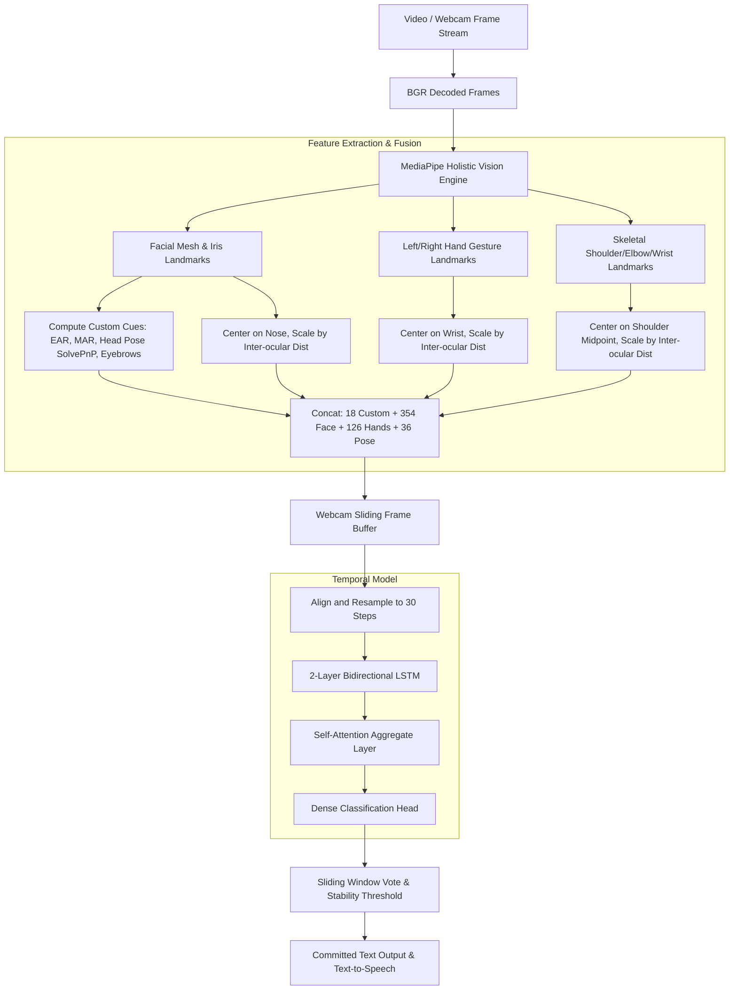

# System Architecture - GESCOM

Project GESCOM implements a robust, lightweight, spatial-temporal classification network that processes landmarks extracted from live webcams or video inputs to predict continuous Indian Sign Language (ISL) phrases.

---

## 1. Complete End-to-End Pipeline Diagram



---

## 2. Feature Dimensions Breakdown

For each frame, a unified **534-dimensional feature vector** is extracted:

| Feature Group | Dimension | Description / Key Indicators |
| --- | --- | --- |
| **Custom Facial Cues** | 18 | 2 Eyebrow height, 1 Eyebrow separation, 1 Eyebrow symmetry, 2 Eye EARs, 1 Average EAR (blink), 4 Iris gaze offsets ($x, y$ deviations), 1 Mouth inner openness, 2 Mouth MARs (inner/outer), 1 Lip width, 3 Head Pose Euler Angles (Pitch, Yaw, Roll). |
| **Normalized Face Mesh** | 354 | $x, y, z$ coordinate offsets for 118 key landmarks covering the contours of eyebrows, eyelids, nose bridge, lips, and jaw. |
| **Left Hand Gestures** | 63 | $x, y, z$ offsets of 21 hand landmarks relative to the wrist. Padded with 0 if hand is not detected. |
| **Right Hand Gestures** | 63 | $x, y, z$ offsets of 21 right hand landmarks relative to the wrist. Padded with 0 if hand is not detected. |
| **Upper Body Pose** | 36 | $x, y, z$ offsets of 12 shoulder, elbow, wrist, and hand pose keypoints centered on shoulder midpoint. |
| **Total Features ($D$)** | **534** | Concatenated single-frame representation. |

---

## 3. Deep Learning Sequence Model Details

The temporal classification model (`ISLAttentionBiLSTM`) is implemented in PyTorch:

```
Input Tensor: (Batch Size, 30, 534)
  │
  ▼
[ 2-Layer Bidirectional LSTM ] ── Hidden state size: 128 (Output size: 256)
  │
  ▼
[ Self-Attention Pooling ] ────── Computes weights α_t for each of the 30 frames
  │
  ▼
[ Context Vector: (256,) ] ────── Weighted sum of LSTM hidden outputs
  │
  ▼
[ Dropout (0.30) ]
  │
  ▼
[ Dense Layer: 256 -> 128 ] ───── ReLU activation
  │
  ▼
[ Dense Classifier: 128 -> 101 ] ── Outputs Logits for 101 target sentences
```

### A. Bidirectional LSTM
The Bidirectional LSTM processes the sequence in both forward and backward directions:
\[\overrightarrow{h_t} = \text{LSTM}_{\text{forward}}(x_t, \overrightarrow{h_{t-1}})\]
\[\overleftarrow{h_t} = \text{LSTM}_{\text{backward}}(x_t, \overleftarrow{h_{t+1}})\]
\[h_t = [\overrightarrow{h_t}; \overleftarrow{h_t}] \in \mathbb{R}^{256}\]
This allows the model to learn features of a sign gesture context before and after the current frame.

### B. Additive Self-Attention
Sign language sentences contain key periods where gestures are most distinct. To learn frame importance dynamically, the self-attention layer aggregates hidden states:
\[e_t = \mathbf{w}_a^T \tanh(W_a h_t + b_a)\]
\[\alpha_t = \frac{\exp(e_t)}{\sum_{i=1}^{T} \exp(e_i)}\]
\[c = \sum_{t=1}^{T} \alpha_t h_t\]
- $W_a$ is the attention weight matrix, $b_a$ is the bias vector.
- $\alpha_t$ is the softmax-normalized attention coefficient for frame $t$, denoting its importance.
- $c \in \mathbb{R}^{256}$ is the context vector fed into the classification MLP.
This mechanism allows judges to see what frames the model focused on during a sign phrase, providing transparent diagnostics.
